# 设计文档

## 概述

TProxy2 是一款 Windows 全局透明代理软件，采用 Python 开发，使用 MVVM 架构实现 UI 与业务逻辑分离。系统支持两种 UI 实现：PyQt GUI 和类似 htop 的终端 TUI，共享相同的 Model 层，但使用独立的 ViewModel 实现。

核心功能包括：
- 内核插件架构：支持多种代理内核（首期实现 singbox）
- 代理服务器管理：CRUD 操作、连接检查
- 路由规则配置：基于进程名、hosts、ports 的流量路由
- 连接监控：实时显示网络连接状态
- 日志系统：采集、显示、持久化
- 多语言与主题支持

## 架构

### 整体架构图

```mermaid
graph TB
    subgraph View["View 层 (UI)"]
        PyQtGUI["PyQt GUI"]
        TUI["Terminal TUI (htop风格)"]
        Headless["Headless (无UI)"]
    end
    
    subgraph GuiViewModel["GUI ViewModel 层"]
        GuiMainVM["GuiMainViewModel"]
        GuiKernelVM["GuiKernelViewModel"]
        GuiProxyVM["GuiProxyServerViewModel"]
        GuiRuleVM["GuiRoutingRuleViewModel"]
        GuiConnVM["GuiConnectionViewModel"]
        GuiLogVM["GuiLogViewModel"]
        GuiSettingsVM["GuiSettingsViewModel"]
    end
    
    subgraph TuiViewModel["TUI ViewModel 层"]
        TuiMainVM["TuiMainViewModel"]
        TuiKernelVM["TuiKernelViewModel"]
        TuiProxyVM["TuiProxyServerViewModel"]
        TuiRuleVM["TuiRoutingRuleViewModel"]
        TuiConnVM["TuiConnectionViewModel"]
        TuiLogVM["TuiLogViewModel"]
        TuiSettingsVM["TuiSettingsViewModel"]
    end
    
    subgraph HeadlessViewModel["Headless ViewModel 层"]
        HeadlessMainVM["HeadlessMainViewModel"]
        HeadlessKernelVM["HeadlessKernelViewModel"]
        HeadlessProxyVM["HeadlessProxyServerViewModel"]
        HeadlessRuleVM["HeadlessRoutingRuleViewModel"]
        HeadlessConnVM["HeadlessConnectionViewModel"]
        HeadlessLogVM["HeadlessLogViewModel"]
    end
    
    subgraph Model["Model 层 (数据 + 核心业务逻辑)"]
        subgraph BusinessLogic["核心业务逻辑"]
            KernelManager["KernelManager"]
            ConfigValidator["ConfigValidator"]
            RuleEngine["RuleEngine"]
            ProxyChecker["ProxyChecker"]
        end
        subgraph DataAccess["数据访问"]
            ConfigStore["ConfigStore"]
            LogCollector["LogCollector"]
            I18nManager["I18nManager"]
            ThemeManager["ThemeManager (GUI)"]
            TuiColorManager["TuiColorManager (TUI)"]
        end
        subgraph KernelAdapters["内核适配器"]
            KernelAdapter["KernelAdapter (抽象)"]
            SingboxAdapter["SingboxAdapter"]
        end
    end
    
    subgraph Preference["偏好设置"]
        SharedPref["共享偏好\n(语言、显示直连等)"]
        GuiPref["GUI偏好\n(主题)"]
        TuiPref["TUI偏好\n(配色方案)"]
    end
    
    subgraph External["外部进程"]
        Singbox["singbox.exe"]
    end
    
    PyQtGUI --> GuiMainVM
    GuiMainVM --> GuiKernelVM
    GuiMainVM --> GuiProxyVM
    GuiMainVM --> GuiRuleVM
    GuiMainVM --> GuiConnVM
    GuiMainVM --> GuiLogVM
    GuiMainVM --> GuiSettingsVM
    
    TUI --> TuiMainVM
    TuiMainVM --> TuiKernelVM
    TuiMainVM --> TuiProxyVM
    TuiMainVM --> TuiRuleVM
    TuiMainVM --> TuiConnVM
    TuiMainVM --> TuiLogVM
    TuiMainVM --> TuiSettingsVM
    
    Headless --> HeadlessMainVM
    HeadlessMainVM --> HeadlessKernelVM
    HeadlessMainVM --> HeadlessProxyVM
    HeadlessMainVM --> HeadlessRuleVM
    HeadlessMainVM --> HeadlessConnVM
    HeadlessMainVM --> HeadlessLogVM
    
    GuiKernelVM --> KernelManager
    TuiKernelVM --> KernelManager
    HeadlessKernelVM --> KernelManager
    
    GuiProxyVM --> ConfigValidator
    GuiProxyVM --> ProxyChecker
    TuiProxyVM --> ConfigValidator
    TuiProxyVM --> ProxyChecker
    HeadlessProxyVM --> ConfigValidator
    HeadlessProxyVM --> ProxyChecker
    
    GuiRuleVM --> RuleEngine
    TuiRuleVM --> RuleEngine
    HeadlessRuleVM --> RuleEngine
    
    GuiSettingsVM --> I18nManager
    GuiSettingsVM --> ThemeManager
    TuiSettingsVM --> I18nManager
    TuiSettingsVM --> TuiColorManager
    
    KernelManager --> KernelAdapter
    KernelAdapter --> SingboxAdapter
    SingboxAdapter --> Singbox
    
    ConfigValidator --> ConfigStore
    RuleEngine --> ConfigStore
    KernelManager --> ConfigStore
    
    GuiLogVM --> LogCollector
    TuiLogVM --> LogCollector
    HeadlessLogVM --> LogCollector
    
    ConfigStore --> SharedPref
    ConfigStore --> GuiPref
    ConfigStore --> TuiPref
```



### MVVM 层次职责

| 层 | 职责 | PyQt 依赖 |
|---|---|---|
| Model | 数据存储、持久化、核心业务逻辑（内核管理、配置验证、规则处理）、内核适配器 | 否 |
| ViewModel | 表示逻辑、UI 状态管理、数据转换、用户交互协调（GUI、TUI、Headless 各自独立实现） | 否 |
| View | UI 渲染、用户交互、事件绑定 | PyQt GUI: 是; TUI: 否; Headless: 无 |

### 业务逻辑分层说明

**Model 层核心业务逻辑：**
- `KernelManager`: 内核生命周期管理（启动/停止/切换流程、单实例约束）
- `ConfigValidator`: 配置验证（名称唯一性、规则约束、引用完整性）
- `RuleEngine`: 路由规则处理（顺序管理、默认规则约束）
- `ProxyChecker`: 代理服务器连接检测
- `ConfigStore`: 数据持久化

**ViewModel 层分离设计：**

GUI、TUI 和 Headless 使用独立的 ViewModel 实现，共享相同的 Model 层：

| ViewModel | GUI 实现 | TUI 实现 | Headless 实现 |
|-----------|---------|---------|--------------|
| 内核管理 | `GuiKernelViewModel` (Observable) | `TuiKernelViewModel` (轮询) | `HeadlessKernelViewModel` (直接调用) |
| 代理服务器 | `GuiProxyServerViewModel` | `TuiProxyServerViewModel` | `HeadlessProxyServerViewModel` |
| 路由规则 | `GuiRoutingRuleViewModel` | `TuiRoutingRuleViewModel` | `HeadlessRoutingRuleViewModel` |
| 连接监控 | `GuiConnectionViewModel` | `TuiConnectionViewModel` | `HeadlessConnectionViewModel` |
| 日志 | `GuiLogViewModel` | `TuiLogViewModel` | `HeadlessLogViewModel` |

**Headless 模式用途：**
- 集成测试：不依赖任何 UI 即可测试完整业务流程
- 自动化脚本：通过 Python API 控制 TProxy2
- CI/CD 环境：在无图形界面的服务器上运行测试

**分离原因：**
- GUI 需要 Observable 模式实现数据绑定和实时更新
- TUI 采用定时刷新模式，使用轮询获取最新数据
- Headless 采用同步调用模式，直接返回结果，无需 UI 更新机制

## 设计原则

本设计遵循以下软件工程原则：

### Clean Architecture 原则

- **依赖规则**：依赖方向从外向内（View → ViewModel → Model），内层不依赖外层
- **依赖抽象**：ViewModel 依赖 `KernelAdapter` 抽象接口，不依赖 `SingboxAdapter` 具体实现
- **关注点分离**：Model 负责业务逻辑，ViewModel 负责表示逻辑，View 负责渲染

### SOLID 原则

- **单一职责（SRP）**：每个类只有一个变化原因（如 `ConfigStore` 只负责持久化）
- **开闭原则（OCP）**：通过 `KernelAdapter` 接口支持新内核扩展，无需修改现有代码
- **里氏替换（LSP）**：所有 `KernelAdapter` 实现可互换使用
- **接口隔离（ISP）**：接口按职责拆分（如 `IConfigReader`、`IConfigWriter`）
- **依赖倒置（DIP）**：高层模块依赖抽象接口，通过依赖注入获取具体实现

### 其他原则

- **KISS**：避免过度设计，优先使用简单直接的方案
- **DRY**：通过值对象封装验证逻辑，避免重复校验代码
- **组合优于继承**：ViewModel 通过组合 Model 层组件实现功能
- **高内聚低耦合**：模块内部紧密相关，模块间通过接口松散耦合

## 值对象（Value Objects）

值对象封装原始类型，在创建时验证业务规则，确保对象始终处于有效状态。这避免了在每个使用点重复验证逻辑。

### 网络相关值对象

```python
from dataclasses import dataclass
from typing import Optional
import re

@dataclass(frozen=True)
class IpAddress:
    """IP 地址值对象 - 支持 IPv4 和域名"""
    
    _value: str
    
    def __post_init__(self):
        if not self._value or not self._value.strip():
            raise ValueError("IP 地址不能为空")
        # 验证 IPv4 格式或域名格式
        ipv4_pattern = r'^(\d{1,3}\.){3}\d{1,3}$'
        domain_pattern = r'^[a-zA-Z0-9]([a-zA-Z0-9\-]*[a-zA-Z0-9])?(\.[a-zA-Z0-9]([a-zA-Z0-9\-]*[a-zA-Z0-9])?)*$'
        if not (re.match(ipv4_pattern, self._value) or re.match(domain_pattern, self._value)):
            raise ValueError(f"无效的 IP 地址或域名: {self._value}")
        if re.match(ipv4_pattern, self._value):
            parts = self._value.split('.')
            if any(int(p) > 255 for p in parts):
                raise ValueError(f"无效的 IPv4 地址: {self._value}")
    
    @property
    def value(self) -> str:
        return self._value
    
    def __str__(self) -> str:
        return self._value


@dataclass(frozen=True)
class Port:
    """端口号值对象 - 1-65535"""
    
    _value: int
    
    def __post_init__(self):
        if not isinstance(self._value, int):
            raise TypeError("端口必须是整数")
        if self._value < 1 or self._value > 65535:
            raise ValueError(f"端口号必须在 1-65535 范围内: {self._value}")
    
    @property
    def value(self) -> int:
        return self._value
    
    def __str__(self) -> str:
        return str(self._value)


@dataclass(frozen=True)
class PortRange:
    """端口范围值对象 - 支持单端口或范围（如 "80" 或 "1000-2000"）"""
    
    _raw: str
    start: int = None
    end: int = None
    
    def __post_init__(self):
        if not self._raw or not self._raw.strip():
            raise ValueError("端口范围不能为空")
        
        if '-' in self._raw:
            parts = self._raw.split('-')
            if len(parts) != 2:
                raise ValueError(f"无效的端口范围格式: {self._raw}")
            start, end = int(parts[0]), int(parts[1])
        else:
            start = end = int(self._raw)
        
        if start < 1 or start > 65535 or end < 1 or end > 65535:
            raise ValueError(f"端口号必须在 1-65535 范围内: {self._raw}")
        if start > end:
            raise ValueError(f"起始端口不能大于结束端口: {self._raw}")
        
        object.__setattr__(self, 'start', start)
        object.__setattr__(self, 'end', end)
    
    def contains(self, port: int) -> bool:
        return self.start <= port <= self.end
    
    def __str__(self) -> str:
        return self._raw


@dataclass(frozen=True)
class HostPattern:
    """主机匹配模式值对象 - 支持通配符（如 "*.google.com"）和 IP 范围"""
    
    _value: str
    
    def __post_init__(self):
        if not self._value or not self._value.strip():
            raise ValueError("主机模式不能为空")
        # 基本格式验证（允许通配符 * 和 IP 范围 -）
        pattern = r'^[\w\.\*\-]+$'
        if not re.match(pattern, self._value):
            raise ValueError(f"无效的主机模式: {self._value}")
    
    @property
    def value(self) -> str:
        return self._value
    
    def is_wildcard(self) -> bool:
        return '*' in self._value
    
    def is_ip_range(self) -> bool:
        return '-' in self._value and not self.is_wildcard()
    
    def __str__(self) -> str:
        return self._value


@dataclass(frozen=True)
class ProxyProtocol:
    """代理协议值对象 - 仅支持 http 和 socks5"""
    
    VALID_PROTOCOLS = ("http", "socks5")
    _value: str
    
    def __post_init__(self):
        if self._value not in self.VALID_PROTOCOLS:
            raise ValueError(f"不支持的协议: {self._value}，仅支持 {self.VALID_PROTOCOLS}")
    
    @property
    def value(self) -> str:
        return self._value
    
    def __str__(self) -> str:
        return self._value
```

### 文件路径值对象

```python
from pathlib import Path

@dataclass(frozen=True)
class FilePath:
    """文件路径值对象 - 验证路径格式（不验证存在性）"""
    
    _value: str
    
    def __post_init__(self):
        if not self._value or not self._value.strip():
            raise ValueError("文件路径不能为空")
        # 验证路径格式有效性
        try:
            Path(self._value)
        except Exception as e:
            raise ValueError(f"无效的文件路径: {self._value}") from e
    
    @property
    def value(self) -> str:
        return self._value
    
    def to_path(self) -> Path:
        return Path(self._value)
    
    def exists(self) -> bool:
        return self.to_path().exists()
    
    def __str__(self) -> str:
        return self._value


@dataclass(frozen=True)
class ExistingFilePath(FilePath):
    """必须存在的文件路径值对象"""
    
    def __post_init__(self):
        super().__post_init__()
        if not self.to_path().exists():
            raise FileNotFoundError(f"文件不存在: {self._value}")
        if not self.to_path().is_file():
            raise ValueError(f"路径不是文件: {self._value}")


@dataclass(frozen=True)
class DirectoryPath:
    """目录路径值对象"""
    
    _value: str
    
    def __post_init__(self):
        if not self._value or not self._value.strip():
            raise ValueError("目录路径不能为空")
    
    @property
    def value(self) -> str:
        return self._value
    
    def to_path(self) -> Path:
        return Path(self._value)
    
    def exists(self) -> bool:
        return self.to_path().exists() and self.to_path().is_dir()
    
    def __str__(self) -> str:
        return self._value
```

### 业务相关值对象

```python
@dataclass(frozen=True)
class ServerName:
    """服务器名称值对象 - 非空、可显示"""
    
    _value: str
    
    def __post_init__(self):
        if not self._value or not self._value.strip():
            raise ValueError("服务器名称不能为空")
        if len(self._value) > 64:
            raise ValueError("服务器名称不能超过 64 个字符")
    
    @property
    def value(self) -> str:
        return self._value
    
    def __str__(self) -> str:
        return self._value


@dataclass(frozen=True)
class RuleName:
    """规则名称值对象 - 非空"""
    
    _value: str
    
    def __post_init__(self):
        if not self._value or not self._value.strip():
            raise ValueError("规则名称不能为空")
        if len(self._value) > 128:
            raise ValueError("规则名称不能超过 128 个字符")
    
    @property
    def value(self) -> str:
        return self._value
    
    def __str__(self) -> str:
        return self._value


@dataclass(frozen=True)
class ProcessPattern:
    """进程名匹配模式值对象 - 支持通配符（如 "chrome*.exe"）"""
    
    _value: str
    
    def __post_init__(self):
        if not self._value or not self._value.strip():
            raise ValueError("进程名模式不能为空")
        # 允许字母、数字、下划线、点、星号
        pattern = r'^[\w\.\*\-]+$'
        if not re.match(pattern, self._value):
            raise ValueError(f"无效的进程名模式: {self._value}")
    
    @property
    def value(self) -> str:
        return self._value
    
    def is_wildcard(self) -> bool:
        return '*' in self._value
    
    def __str__(self) -> str:
        return self._value


class RouteActionType:
    """路由行为类型枚举"""
    DIRECT = "direct"
    BLOCK = "block"
    PROXY = "proxy"
    
    VALID_TYPES = (DIRECT, BLOCK, PROXY)
    
    @classmethod
    def validate(cls, value: str) -> str:
        if value not in cls.VALID_TYPES:
            raise ValueError(f"无效的路由行为: {value}，仅支持 {cls.VALID_TYPES}")
        return value
```

### 值对象使用示例

```python
# 创建代理服务器时使用值对象
server = ProxyServer(
    name=ServerName("office"),
    address=IpAddress("127.0.0.1"),
    port=Port(10808),
    protocol=ProxyProtocol("socks5")
)

# 创建路由规则时使用值对象
rule = RoutingRule(
    enabled=True,
    name=RuleName("Chrome via Proxy"),
    app_names=[ProcessPattern("chrome.exe")],
    hosts=[HostPattern("*.google.com")],
    ports=[PortRange("443")],
    action=RouteAction(type=RouteActionType.PROXY, proxy_server_name=ServerName("office"))
)

# 值对象在创建时已验证，后续使用无需再次验证
def apply_config(self, rules: List[RoutingRule]) -> None:
    # 无需验证 rules 中的值，因为值对象保证了有效性
    for rule in rules:
        self._write_rule(rule)
```

## 依赖注入与接口抽象

### 抽象接口定义

```python
from abc import ABC, abstractmethod
from typing import Protocol

class IConfigReader(Protocol):
    """配置读取接口"""
    def load_rules(self) -> 'RulesConfig': ...
    def load_preference(self) -> 'PreferenceConfig': ...

class IConfigWriter(Protocol):
    """配置写入接口"""
    def save_rules(self, config: 'RulesConfig') -> None: ...
    def save_preference(self, config: 'PreferenceConfig') -> None: ...

class ILogSink(Protocol):
    """日志输出接口"""
    def write(self, entry: 'LogEntry') -> None: ...

class IKernelAdapter(ABC):
    """内核适配器抽象接口"""
    
    @abstractmethod
    def start(self) -> None: ...
    
    @abstractmethod
    def stop(self) -> None: ...
    
    @abstractmethod
    def get_status(self) -> 'KernelStatus': ...
    
    @abstractmethod
    def apply_config(self, rules: 'RulesConfig') -> None: ...
    
    @abstractmethod
    def get_connections_snapshot(self) -> List['ConnectionInfo']: ...
```

### 依赖注入容器

```python
from dataclasses import dataclass
from typing import TypeVar, Type, Dict, Callable

T = TypeVar('T')

class Container:
    """简单的依赖注入容器"""
    
    def __init__(self):
        self._factories: Dict[Type, Callable] = {}
        self._singletons: Dict[Type, object] = {}
    
    def register(self, interface: Type[T], factory: Callable[[], T], singleton: bool = True) -> None:
        """注册接口与实现的映射"""
        self._factories[interface] = (factory, singleton)
    
    def resolve(self, interface: Type[T]) -> T:
        """解析接口获取实例"""
        if interface in self._singletons:
            return self._singletons[interface]
        
        factory, singleton = self._factories.get(interface, (None, False))
        if factory is None:
            raise ValueError(f"未注册的接口: {interface}")
        
        instance = factory()
        if singleton:
            self._singletons[interface] = instance
        return instance


# 应用启动时配置依赖
def configure_container(container: Container, config_dir: str) -> None:
    """配置依赖注入容器"""
    # 注册 Model 层组件
    container.register(IConfigReader, lambda: ConfigStore(config_dir))
    container.register(IConfigWriter, lambda: ConfigStore(config_dir))
    container.register(IKernelAdapter, lambda: SingboxAdapter(
        exe_path=FilePath(f"{config_dir}/plugins/singbox/singbox.exe"),
        config_path=FilePath(f"{config_dir}/plugins/singbox/config.json")
    ))
    container.register(LogCollector, lambda: LogCollector(DirectoryPath(config_dir)))
    
    # 注册业务逻辑组件
    container.register(ConfigValidator, lambda: ConfigValidator(container.resolve(IConfigReader)))
    container.register(RuleEngine, lambda: RuleEngine(
        container.resolve(IConfigReader),
        container.resolve(IConfigWriter),
        container.resolve(ConfigValidator)
    ))
    container.register(KernelManager, lambda: KernelManager(
        container.resolve(IConfigReader),
        container.resolve(IKernelAdapter)
    ))
```

## 组件与接口

### Model 层组件

#### KernelManager (核心业务逻辑)

```python
class KernelManager:
    """内核生命周期管理 - 核心业务逻辑
    
    职责：管理内核的启动、停止、切换，确保单实例约束
    依赖：IConfigReader（抽象）、IKernelAdapter（抽象）
    """
    
    def __init__(self, config_reader: IConfigReader, adapter: IKernelAdapter):
        self._config_reader = config_reader
        self._adapter = adapter
        self._status_handlers: List[Callable] = []
    
    def register_adapter(self, name: str, adapter: KernelAdapter) -> None:
        """注册内核适配器"""
        self._adapters[name] = adapter
    
    def get_available_kernels(self) -> List[str]:
        """获取可用内核列表"""
        return list(self._adapters.keys())
    
    def get_current_kernel(self) -> Optional[str]:
        return self._current_kernel
    
    def get_status(self) -> KernelStatus:
        if self._current_kernel and self._current_kernel in self._adapters:
            return self._adapters[self._current_kernel].get_status()
        return KernelStatus.STOPPED
    
    def start(self) -> None:
        """启动当前内核 - 包含配置应用"""
        if not self._current_kernel:
            raise ValueError("未选择内核")
        adapter = self._adapters[self._current_kernel]
        if adapter.get_status() != KernelStatus.STOPPED:
            raise ValueError("内核未处于停止状态")
        
        # 应用配置
        rules = self._config_store.load_rules()
        adapter.apply_config(rules.__dict__)
        adapter.start()
    
    def stop(self) -> None:
        """停止当前内核"""
        if not self._current_kernel:
            return
        adapter = self._adapters[self._current_kernel]
        if adapter.get_status() == KernelStatus.RUNNING:
            adapter.stop()
    
    def switch_kernel(self, kernel_name: str) -> None:
        """切换内核 - 确保单实例"""
        if kernel_name not in self._adapters:
            raise ValueError(f"未知内核: {kernel_name}")
        
        current_status = self.get_status()
        if current_status in (KernelStatus.STARTING, KernelStatus.STOPPING):
            raise ValueError("内核处于过渡状态，无法切换")
        
        # 先停止当前内核
        if current_status == KernelStatus.RUNNING:
            self.stop()
            # 等待停止完成...
        
        self._current_kernel = kernel_name
    
    def requires_confirmation(self) -> bool:
        """判断操作是否需要用户确认"""
        return self.get_status() == KernelStatus.RUNNING
    
    def subscribe_status(self, handler: Callable[[KernelStatus], None]) -> None:
        self._status_handlers.append(handler)
        if self._current_kernel:
            self._adapters[self._current_kernel].subscribe_status(handler)
```

#### ConfigValidator (配置验证)

```python
class ConfigValidator:
    """配置验证 - 核心业务逻辑"""
    
    def __init__(self, config_store: ConfigStore):
        self._config_store = config_store
    
    def validate_proxy_server_name(self, name: str, exclude_name: Optional[str] = None) -> None:
        """验证代理服务器名称唯一性"""
        config = self._config_store.load_rules()
        for server in config.proxy_servers:
            if server.name == name and server.name != exclude_name:
                raise ValueError(f"代理服务器名称 '{name}' 已存在")
    
    def validate_routing_rule(self, rule: RoutingRule) -> None:
        """验证路由规则"""
        if not rule.name or not rule.name.strip():
            raise ValueError("规则名称不能为空")
        if rule.action.type not in ("direct", "block", "proxy"):
            raise ValueError("无效的路由行为")
        if rule.action.type == "proxy" and not rule.action.proxy_server_name:
            raise ValueError("使用代理时必须指定代理服务器")
    
    def get_rules_referencing_proxy(self, proxy_name: str) -> List[RoutingRule]:
        """获取引用指定代理的规则列表"""
        config = self._config_store.load_rules()
        return [
            r for r in config.routing_rules
            if r.action.type == "proxy" and r.action.proxy_server_name == proxy_name
        ]
    
    def validate_proxy_reference(self, proxy_name: str) -> None:
        """验证代理服务器引用存在"""
        config = self._config_store.load_rules()
        if not any(s.name == proxy_name for s in config.proxy_servers):
            raise ValueError(f"代理服务器 '{proxy_name}' 不存在")
```

#### RuleEngine (规则引擎)

```python
class RuleEngine:
    """路由规则处理 - 核心业务逻辑"""
    
    def __init__(self, config_store: ConfigStore, validator: ConfigValidator):
        self._config_store = config_store
        self._validator = validator
    
    def get_rules(self) -> List[RoutingRule]:
        config = self._config_store.load_rules()
        return config.routing_rules
    
    def add_rule(self, rule: RoutingRule) -> List[RoutingRule]:
        """添加规则（插入到默认规则之前）"""
        self._validator.validate_routing_rule(rule)
        config = self._config_store.load_rules()
        rules = config.routing_rules.copy()
        # 插入到默认规则之前
        insert_index = len(rules) - 1
        rules.insert(insert_index, rule)
        return rules
    
    def move_rule(self, rules: List[RoutingRule], from_idx: int, to_idx: int) -> List[RoutingRule]:
        """移动规则（默认规则不可移动）"""
        if rules[from_idx].is_default:
            return rules  # 默认规则不可移动
        if to_idx >= len(rules) - 1:
            to_idx = len(rules) - 2  # 不能移到默认规则之后
        
        result = rules.copy()
        rule = result.pop(from_idx)
        result.insert(to_idx, rule)
        return result
    
    def copy_rule(self, rules: List[RoutingRule], index: int) -> Tuple[List[RoutingRule], RoutingRule]:
        """复制规则"""
        original = rules[index]
        if original.is_default:
            raise ValueError("无法复制默认规则")
        
        copied = RoutingRule(
            enabled=original.enabled,
            name=f"复制 自 {original.name}",
            app_names=original.app_names.copy(),
            hosts=original.hosts.copy(),
            ports=original.ports.copy(),
            action=original.action,
            is_default=False
        )
        return self.add_rule(copied), copied
    
    def ensure_default_rule(self, rules: List[RoutingRule]) -> List[RoutingRule]:
        """确保默认规则存在且在末尾"""
        default_rules = [r for r in rules if r.is_default]
        non_default_rules = [r for r in rules if not r.is_default]
        
        if not default_rules:
            default_rules = [RoutingRule(
                enabled=True,
                name="默认",
                app_names=[],
                hosts=[],
                ports=[],
                action=RouteAction(type="direct"),
                is_default=True
            )]
        
        return non_default_rules + default_rules[:1]
```

#### KernelAdapter (抽象基类)

```python
from abc import ABC, abstractmethod
from enum import Enum
from typing import Callable, List, Optional
from dataclasses import dataclass

class KernelStatus(Enum):
    STOPPED = "stopped"
    STARTING = "starting"
    RUNNING = "running"
    STOPPING = "stopping"

class ConnectionStatus(Enum):
    CONNECTING = "connecting"
    CONNECTED = "connected"
    ERROR = "error"
    CLOSED = "closed"

@dataclass
class ConnectionInfo:
    id: str
    process_name: str
    target_address: str
    target_port: int
    status: ConnectionStatus
    duration_seconds: float
    route_result: str  # "direct" | "proxy" | "block"
    rule_name: str
    bytes_sent: int
    bytes_received: int
    upload_speed: float
    download_speed: float

class KernelAdapter(ABC):
    @abstractmethod
    def start(self) -> None: ...
    
    @abstractmethod
    def stop(self) -> None: ...
    
    @abstractmethod
    def restart(self) -> None: ...
    
    @abstractmethod
    def apply_config(self, rules: dict) -> None: ...
    
    @abstractmethod
    def get_status(self) -> KernelStatus: ...
    
    @abstractmethod
    def get_connections_snapshot(self) -> List[ConnectionInfo]: ...
    
    @abstractmethod
    def subscribe_connections(self, handler: Callable[[str, ConnectionInfo], None]) -> None: ...
    
    @abstractmethod
    def subscribe_status(self, handler: Callable[[KernelStatus], None]) -> None: ...
    
    @abstractmethod
    def unsubscribe_connections(self, handler: Callable) -> None: ...
    
    @abstractmethod
    def unsubscribe_status(self, handler: Callable) -> None: ...
```

#### ConfigStore

```python
# 使用值对象的数据类型定义

@dataclass
class ProxyServer:
    """代理服务器配置 - 使用值对象确保数据有效性"""
    name: ServerName
    address: IpAddress
    port: Port
    protocol: ProxyProtocol
    
    def to_dict(self) -> dict:
        """序列化为字典（用于 JSON 存储）"""
        return {
            "name": self.name.value,
            "address": self.address.value,
            "port": self.port.value,
            "protocol": self.protocol.value
        }
    
    @classmethod
    def from_dict(cls, data: dict) -> 'ProxyServer':
        """从字典反序列化（值对象在此处验证）"""
        return cls(
            name=ServerName(data["name"]),
            address=IpAddress(data["address"]),
            port=Port(data["port"]),
            protocol=ProxyProtocol(data["protocol"])
        )


@dataclass
class RouteAction:
    """路由行为配置"""
    type: str  # RouteActionType.DIRECT | BLOCK | PROXY
    proxy_server_name: Optional[ServerName] = None
    
    def __post_init__(self):
        RouteActionType.validate(self.type)
        if self.type == RouteActionType.PROXY and not self.proxy_server_name:
            raise ValueError("使用代理时必须指定代理服务器名称")
    
    def to_dict(self) -> dict:
        result = {"type": self.type}
        if self.proxy_server_name:
            result["proxyServerName"] = self.proxy_server_name.value
        return result
    
    @classmethod
    def from_dict(cls, data: dict) -> 'RouteAction':
        proxy_name = data.get("proxyServerName")
        return cls(
            type=data["type"],
            proxy_server_name=ServerName(proxy_name) if proxy_name else None
        )


@dataclass
class RoutingRule:
    """路由规则配置 - 使用值对象列表"""
    enabled: bool
    name: RuleName
    app_names: List[ProcessPattern]  # 空列表表示"任何"
    hosts: List[HostPattern]         # 空列表表示"任何"
    ports: List[PortRange]           # 空列表表示"任何"
    action: RouteAction
    is_default: bool = False
    
    def to_dict(self) -> dict:
        return {
            "enabled": self.enabled,
            "name": self.name.value,
            "appNames": [p.value for p in self.app_names],
            "hosts": [h.value for h in self.hosts],
            "ports": [p._raw for p in self.ports],
            "action": self.action.to_dict(),
            "isDefault": self.is_default
        }
    
    @classmethod
    def from_dict(cls, data: dict) -> 'RoutingRule':
        return cls(
            enabled=data["enabled"],
            name=RuleName(data["name"]),
            app_names=[ProcessPattern(p) for p in data.get("appNames", [])],
            hosts=[HostPattern(h) for h in data.get("hosts", [])],
            ports=[PortRange(p) for p in data.get("ports", [])],
            action=RouteAction.from_dict(data["action"]),
            is_default=data.get("isDefault", False)
        )


class DnsMode:
    """DNS 模式枚举"""
    SYSTEM = "system"
    PROXY = "proxy"
    VALID_MODES = (SYSTEM, PROXY)
    
    @classmethod
    def validate(cls, value: str) -> str:
        if value not in cls.VALID_MODES:
            raise ValueError(f"无效的 DNS 模式: {value}")
        return value


@dataclass
class DnsSettings:
    """DNS 设置"""
    mode: str
    
    def __post_init__(self):
        DnsMode.validate(self.mode)


@dataclass
class RulesConfig:
    """业务规则配置"""
    version: int
    proxy_servers: List[ProxyServer]
    routing_rules: List[RoutingRule]
    dns: DnsSettings


@dataclass
class UiPreference:
    """共享 UI 偏好设置"""
    show_direct_connections: bool
    log_auto_refresh: bool
    log_auto_scroll: bool
    language: str
    proxy_checker_default_target: str


@dataclass
class GuiPreference:
    """GUI 专属偏好设置"""
    theme: str  # "light" | "dark"


@dataclass
class TuiPreference:
    """TUI 专属偏好设置"""
    color_scheme: str  # "default" | "monochrome"


@dataclass
class PreferenceConfig:
    """偏好设置配置"""
    version: int
    ui: UiPreference
    gui: GuiPreference
    tui: TuiPreference


class ConfigStore(IConfigReader, IConfigWriter):
    """配置持久化 - 实现读写接口
    
    职责：JSON 文件的读写，数据序列化/反序列化
    值对象在 from_dict 时自动验证数据有效性
    """
    
    def __init__(self, config_dir: DirectoryPath):
        self._config_dir = config_dir
        self._rules_path = config_dir.to_path() / "rules.json"
        self._preference_path = config_dir.to_path() / "preference.json"
    
    def load_rules(self) -> RulesConfig:
        """加载业务规则，值对象自动验证"""
        if not self._rules_path.exists():
            return self._default_rules()
        
        with open(self._rules_path, 'r', encoding='utf-8') as f:
            data = json.load(f)
        
        return RulesConfig(
            version=data["version"],
            proxy_servers=[ProxyServer.from_dict(s) for s in data["proxyServers"]],
            routing_rules=[RoutingRule.from_dict(r) for r in data["routingRules"]],
            dns=DnsSettings(mode=data["dns"]["mode"])
        )
    
    def save_rules(self, config: RulesConfig) -> None:
        """保存业务规则"""
        data = {
            "version": config.version,
            "proxyServers": [s.to_dict() for s in config.proxy_servers],
            "routingRules": [r.to_dict() for r in config.routing_rules],
            "dns": {"mode": config.dns.mode}
        }
        with open(self._rules_path, 'w', encoding='utf-8') as f:
            json.dump(data, f, indent=2, ensure_ascii=False)
    
    def load_preference(self) -> PreferenceConfig: ...
    def save_preference(self, config: PreferenceConfig) -> None: ...
    def _default_rules(self) -> RulesConfig: ...
```

#### SingboxAdapter

```python
class SingboxAdapter(IKernelAdapter):
    """Singbox 内核适配器实现
    
    职责：管理 singbox 进程的生命周期
    使用值对象确保路径有效性
    """
    
    STARTED_MARKER = "sing-box started"
    
    def __init__(self, exe_path: FilePath, config_path: FilePath):
        self._exe_path = exe_path
        self._config_path = config_path
        self._status = KernelStatus.STOPPED
        self._process: Optional[subprocess.Popen] = None
        self._status_handlers: List[Callable] = []
        self._connection_handlers: List[Callable] = []
        self._connections: Dict[str, ConnectionInfo] = {}
    
    def start(self) -> None:
        # 1. 使用值对象检查文件存在性（ExistingFilePath）
        exe = ExistingFilePath(self._exe_path.value)
        config = ExistingFilePath(self._config_path.value)
        # 2. 启动进程
        # 3. 监听输出，检测 STARTED_MARKER
        # 4. 更新状态
        ...
    
    def stop(self) -> None:
        # 1. 发送终止信号
        # 2. 等待进程退出
        # 3. 更新状态
        ...
    
    def apply_config(self, rules: dict) -> None:
        # 将业务规则转换为 singbox 配置格式
        # 写入 CONFIG_PATH
        ...
```

#### LogCollector

```python
class LogEntry:
    timestamp: datetime
    level: str  # "info" | "warning" | "error"
    source: str  # "app" | "kernel"
    message: str

class LogCollector:
    def __init__(self, log_dir: str = "."):
        self._log_file: Optional[TextIO] = None
        self._entries: List[LogEntry] = []
        self._handlers: List[Callable[[LogEntry], None]] = []
    
    def start(self) -> None:
        # 创建日志文件 {年-月-日-小时-分钟-秒}.log
        ...
    
    def log(self, level: str, source: str, message: str) -> None:
        # 写入文件并通知订阅者
        ...
    
    def subscribe(self, handler: Callable[[LogEntry], None]) -> None: ...
    def unsubscribe(self, handler: Callable) -> None: ...
    def get_entries(self) -> List[LogEntry]: ...
    def clear_memory(self) -> None:
        # 仅清除内存中的日志，不清除文件
        ...
```

#### I18nManager

```python
class I18nManager:
    LANGUAGES_DIR = "./languages"
    
    def __init__(self):
        self._current_lang: str = "zh-CN"
        self._strings: Dict[str, str] = {}
    
    def load_language(self, lang_code: str) -> None:
        # 加载 {lang_code}.language 文件
        ...
    
    def get_string(self, key: str) -> str:
        return self._strings.get(key, key)
    
    def get_available_languages(self) -> List[Tuple[str, str]]:
        # 返回 [(code, name), ...]
        ...
```

#### ThemeManager

```python
@dataclass
class ThemeColors:
    accent: str
    text: str
    muted_text: str
    error: str
    success: str
    warning: str

class ThemeManager:
    THEMES_DIR = "./themes"
    
    def __init__(self):
        self._current_theme: str = "light"
        self._colors: ThemeColors = None
    
    def load_theme(self, theme_name: str) -> None:
        # 加载 {theme_name}.theme 文件
        ...
    
    def get_colors(self) -> ThemeColors: ...
    def get_available_themes(self) -> List[str]: ...
```

### ViewModel 层组件

GUI 和 CLI 使用独立的 ViewModel 实现。GUI ViewModel 使用 Observable 模式支持数据绑定和实时更新；CLI ViewModel 采用命令式交互，使用请求-响应模式。

#### Observable 基类（仅 GUI ViewModel 使用）

```python
from typing import Callable, List, Any, TypeVar, Generic

T = TypeVar('T')

class Observable(Generic[T]):
    """可观察属性，用于 GUI ViewModel 通知 View 更新"""
    
    def __init__(self, initial_value: T):
        self._value = initial_value
        self._observers: List[Callable[[T], None]] = []
    
    @property
    def value(self) -> T:
        return self._value
    
    @value.setter
    def value(self, new_value: T) -> None:
        if self._value != new_value:
            self._value = new_value
            self._notify()
    
    def subscribe(self, observer: Callable[[T], None]) -> None:
        self._observers.append(observer)
    
    def unsubscribe(self, observer: Callable[[T], None]) -> None:
        self._observers.remove(observer)
    
    def _notify(self) -> None:
        for observer in self._observers:
            observer(self._value)
```

---

### GUI ViewModel 实现

GUI ViewModel 使用 Observable 模式，支持 PyQt 的信号槽绑定和实时 UI 更新。

#### GuiKernelViewModel

```python
class GuiKernelViewModel:
    def __init__(self, adapter: KernelAdapter, config_store: ConfigStore):
        self._adapter = adapter
        self._config_store = config_store
        
        # 可观察状态
        self.status = Observable(KernelStatus.STOPPED)
        self.can_start = Observable(True)
        self.can_stop = Observable(False)
        self.can_restart = Observable(False)
        self.available_kernels = Observable(["singbox"])
        self.selected_kernel = Observable("singbox")
        
        # 订阅内核状态变化
        self._adapter.subscribe_status(self._on_status_changed)
    
    def _on_status_changed(self, status: KernelStatus) -> None:
        self.status.value = status
        self._update_button_states()
    
    def _update_button_states(self) -> None:
        status = self.status.value
        self.can_start.value = status == KernelStatus.STOPPED
        self.can_stop.value = status == KernelStatus.RUNNING
        self.can_restart.value = status == KernelStatus.RUNNING
    
    def start_kernel(self) -> None:
        if self.can_start.value:
            rules = self._config_store.load_rules()
            self._adapter.apply_config(rules.__dict__)
            self._adapter.start()
    
    def stop_kernel(self, confirmed: bool = False) -> bool:
        """返回是否需要确认"""
        if self.status.value == KernelStatus.RUNNING and not confirmed:
            return True  # 需要确认
        if self.can_stop.value:
            self._adapter.stop()
        return False
    
    def restart_kernel(self, confirmed: bool = False) -> bool:
        if self.status.value == KernelStatus.RUNNING and not confirmed:
            return True
        if self.can_restart.value:
            self._adapter.restart()
        return False
    
    def switch_kernel(self, kernel_name: str, confirmed: bool = False) -> bool:
        if self.status.value == KernelStatus.RUNNING and not confirmed:
            return True
        if self.status.value in (KernelStatus.STARTING, KernelStatus.STOPPING):
            raise ValueError("内核状态不可切换")
        # 切换逻辑...
        self.selected_kernel.value = kernel_name
        return False
```

#### GuiProxyServerViewModel

```python
class GuiProxyServerViewModel:
    def __init__(self, config_store: ConfigStore):
        self._config_store = config_store
        self.servers = Observable[List[ProxyServer]]([])
        self.selected_index = Observable(-1)
        self._load_servers()
    
    def _load_servers(self) -> None:
        config = self._config_store.load_rules()
        self.servers.value = config.proxy_servers
    
    def add_server(self, server: ProxyServer) -> None:
        # 校验名称唯一性
        if any(s.name == server.name for s in self.servers.value):
            raise ValueError(f"代理服务器名称 '{server.name}' 已存在")
        servers = self.servers.value.copy()
        servers.append(server)
        self.servers.value = servers
        self._save()
    
    def update_server(self, index: int, server: ProxyServer) -> None:
        servers = self.servers.value.copy()
        old_name = servers[index].name
        # 校验名称唯一性（排除自身）
        if server.name != old_name and any(s.name == server.name for s in servers):
            raise ValueError(f"代理服务器名称 '{server.name}' 已存在")
        servers[index] = server
        self.servers.value = servers
        self._save()
    
    def delete_server(self, index: int) -> List[RoutingRule]:
        """返回引用该服务器的规则列表"""
        server = self.servers.value[index]
        config = self._config_store.load_rules()
        referencing_rules = [
            r for r in config.routing_rules
            if r.action.type == "proxy" and r.action.proxy_server_name == server.name
        ]
        return referencing_rules
    
    def confirm_delete(self, index: int, rule_updates: Dict[str, RouteAction]) -> None:
        """确认删除，同时更新引用规则"""
        # 更新规则
        # 删除服务器
        ...
    
    def _save(self) -> None:
        config = self._config_store.load_rules()
        config.proxy_servers = self.servers.value
        self._config_store.save_rules(config)
```

#### GuiRoutingRuleViewModel

```python
class GuiRoutingRuleViewModel:
    def __init__(self, config_store: ConfigStore):
        self._config_store = config_store
        self.rules = Observable[List[RoutingRule]]([])
        self._pending_rules: List[RoutingRule] = []  # 未确认的修改
        self._load_rules()
    
    def _load_rules(self) -> None:
        config = self._config_store.load_rules()
        self.rules.value = config.routing_rules
        self._pending_rules = [r for r in config.routing_rules]
    
    def add_rule(self, rule: RoutingRule) -> None:
        # 插入到默认规则之前
        rules = self._pending_rules.copy()
        insert_index = len(rules) - 1  # 默认规则前
        rules.insert(insert_index, rule)
        self._pending_rules = rules
        self.rules.value = rules
    
    def copy_rule(self, index: int) -> None:
        original = self._pending_rules[index]
        copied = RoutingRule(
            enabled=original.enabled,
            name=f"复制 自 {original.name}",
            app_names=original.app_names.copy(),
            hosts=original.hosts.copy(),
            ports=original.ports.copy(),
            action=original.action,
            is_default=False
        )
        self.add_rule(copied)
    
    def move_rule(self, from_index: int, to_index: int) -> None:
        rules = self._pending_rules.copy()
        # 不允许移动默认规则
        if rules[from_index].is_default or to_index >= len(rules) - 1:
            return
        rule = rules.pop(from_index)
        rules.insert(to_index, rule)
        self._pending_rules = rules
        self.rules.value = rules
    
    def confirm(self) -> None:
        """确认保存"""
        config = self._config_store.load_rules()
        config.routing_rules = self._pending_rules
        self._config_store.save_rules(config)
    
    def cancel(self) -> None:
        """取消修改"""
        self._load_rules()
```

#### GuiConnectionViewModel

```python
class GuiConnectionViewModel:
    CLOSED_DISPLAY_DURATION = 2.0  # 关闭连接显示2秒后消失
    
    def __init__(self, kernel_adapter: KernelAdapter, config_store: ConfigStore):
        self._adapter = kernel_adapter
        self._config_store = config_store
        
        self.connections = Observable[List[ConnectionInfo]]([])
        self.filter_text = Observable("")
        self.show_direct = Observable(False)
        
        self._all_connections: Dict[str, ConnectionInfo] = {}
        self._closed_timers: Dict[str, float] = {}
        
        self._adapter.subscribe_connections(self._on_connection_event)
        self._load_preference()
    
    def _load_preference(self) -> None:
        pref = self._config_store.load_preference()
        self.show_direct.value = pref.ui.show_direct_connections
    
    def _on_connection_event(self, event_type: str, conn: ConnectionInfo) -> None:
        if event_type == "add":
            self._all_connections[conn.id] = conn
        elif event_type == "update":
            self._all_connections[conn.id] = conn
        elif event_type == "close":
            conn.status = ConnectionStatus.CLOSED
            self._all_connections[conn.id] = conn
            self._closed_timers[conn.id] = time.time()
        self._update_filtered_list()
    
    def _update_filtered_list(self) -> None:
        now = time.time()
        # 移除超时的关闭连接
        for conn_id, close_time in list(self._closed_timers.items()):
            if now - close_time > self.CLOSED_DISPLAY_DURATION:
                del self._all_connections[conn_id]
                del self._closed_timers[conn_id]
        
        # 应用过滤
        filtered = []
        for conn in self._all_connections.values():
            # 直连过滤
            if not self.show_direct.value and conn.route_result == "direct":
                continue
            # 文本过滤
            if self.filter_text.value:
                search = self.filter_text.value.lower()
                if not any(search in str(v).lower() for v in [
                    conn.process_name, conn.target_address, conn.rule_name
                ]):
                    continue
            filtered.append(conn)
        
        self.connections.value = filtered
    
    def set_filter(self, text: str) -> None:
        self.filter_text.value = text
        self._update_filtered_list()
    
    def set_show_direct(self, show: bool) -> None:
        self.show_direct.value = show
        pref = self._config_store.load_preference()
        pref.ui.show_direct_connections = show
        self._config_store.save_preference(pref)
        self._update_filtered_list()
    
    def clear_all(self) -> None:
        """内核停止时清空所有连接"""
        self._all_connections.clear()
        self._closed_timers.clear()
        self.connections.value = []
```

#### GuiLogViewModel

```python
class GuiLogViewModel:
    ERROR_KEYWORDS = ["error", "warning", "warn", "failed"]
    
    def __init__(self, log_collector: LogCollector, config_store: ConfigStore):
        self._collector = log_collector
        self._config_store = config_store
        
        self.entries = Observable[List[LogEntry]]([])
        self.filter_text = Observable("")
        self.auto_refresh = Observable(True)
        self.auto_scroll = Observable(True)
        
        self._collector.subscribe(self._on_new_entry)
        self._load_preference()
    
    def _load_preference(self) -> None:
        pref = self._config_store.load_preference()
        self.auto_refresh.value = pref.ui.log_auto_refresh
        self.auto_scroll.value = pref.ui.log_auto_scroll
    
    def _on_new_entry(self, entry: LogEntry) -> None:
        if self.auto_refresh.value:
            self._update_filtered_list()
    
    def is_error_line(self, message: str) -> bool:
        """判断是否为错误行（用于高亮显示）"""
        lower_msg = message.lower()
        return any(kw in lower_msg for kw in self.ERROR_KEYWORDS)
    
    def _update_filtered_list(self) -> None:
        all_entries = self._collector.get_entries()
        if self.filter_text.value:
            search = self.filter_text.value.lower()
            filtered = [e for e in all_entries if search in e.message.lower()]
        else:
            filtered = all_entries
        self.entries.value = filtered
    
    def clear_display(self) -> None:
        """清除 UI 显示的日志（不清除文件）"""
        self._collector.clear_memory()
        self.entries.value = []
    
    def set_auto_refresh(self, enabled: bool) -> None:
        self.auto_refresh.value = enabled
        self._save_preference()
    
    def set_auto_scroll(self, enabled: bool) -> None:
        self.auto_scroll.value = enabled
        self._save_preference()
    
    def _save_preference(self) -> None:
        pref = self._config_store.load_preference()
        pref.ui.log_auto_refresh = self.auto_refresh.value
        pref.ui.log_auto_scroll = self.auto_scroll.value
        self._config_store.save_preference(pref)
```

---

### TUI ViewModel 实现

TUI ViewModel 采用定时刷新模式，适合类似 htop 的全屏终端界面。使用回调机制获取实时数据更新。

#### TUI 界面布局设计

```
┌─────────────────────────────────────────────────────────────────────────────┐
│ F1:启动 F2:停止 F3:重启 F4:代理服务器 F5:路由规则 F6:DNS /:过滤 Q:退出      │
│ 内核: singbox [运行中]                                                       │
├─────────────────────────────────────────────────────────────────────────────┤
│ 连接列表 (显示直连: 关)                                          [过滤: ]   │
├──────────┬─────────────────────┬────────┬────────┬──────┬──────┬──────┬─────┤
│ 进程名   │ 目标地址:端口       │ 状态   │ 规则   │ 发送 │ 接收 │ 上传 │ 下载│
├──────────┼─────────────────────┼────────┼────────┼──────┼──────┼──────┼─────┤
│ chrome   │ www.google.com:443  │ 已连接 │ Chrome │ 1.2M │ 5.6M │ 12K/s│ 56K │
│ firefox  │ github.com:443      │ 连接中 │ 默认   │ 0    │ 0    │ 0    │ 0   │
│ curl     │ api.example.com:80  │ 出错   │ API    │ 512B │ 0    │ 0    │ 0   │
├──────────┴─────────────────────┴────────┴────────┴──────┴──────┴──────┴─────┤
│ 日志 [自动刷新: 开] [自动滚动: 开]                                           │
├─────────────────────────────────────────────────────────────────────────────┤
│ 14:32:01 [INFO] 内核启动成功                                                 │
│ 14:32:02 [INFO] 开始监听连接                                                 │
│ 14:32:05 [WARN] 连接超时: api.example.com:80                                 │
│ 14:32:10 [ERROR] 代理服务器连接失败                                          │
└─────────────────────────────────────────────────────────────────────────────┘
```

#### TuiKernelViewModel

```python
class TuiKernelViewModel:
    """TUI 内核管理 ViewModel - 定时刷新模式"""
    
    def __init__(self, kernel_manager: KernelManager):
        self._manager = kernel_manager
        self._status_callback: Optional[Callable] = None
    
    def get_status(self) -> dict:
        """获取当前内核状态（供定时刷新调用）"""
        status = self._manager.get_status()
        return {
            "kernel": self._manager.get_current_kernel() or "未选择",
            "status": status.value,
            "status_text": self._get_status_text(status),
            "can_start": status == KernelStatus.STOPPED,
            "can_stop": status == KernelStatus.RUNNING,
            "can_restart": status == KernelStatus.RUNNING,
            "available_kernels": self._manager.get_available_kernels()
        }
    
    def _get_status_text(self, status: KernelStatus) -> str:
        return {
            KernelStatus.STOPPED: "已停止",
            KernelStatus.STARTING: "启动中",
            KernelStatus.RUNNING: "运行中",
            KernelStatus.STOPPING: "停止中"
        }.get(status, "未知")
    
    def start(self) -> dict:
        try:
            self._manager.start()
            return {"success": True, "message": "内核启动成功"}
        except Exception as e:
            return {"success": False, "error": str(e)}
    
    def stop(self, confirmed: bool = False) -> dict:
        if self._manager.requires_confirmation() and not confirmed:
            return {"needs_confirmation": True, "message": "正在联网的应用的网络连接会中断"}
        try:
            self._manager.stop()
            return {"success": True, "message": "内核已停止"}
        except Exception as e:
            return {"success": False, "error": str(e)}
    
    def restart(self, confirmed: bool = False) -> dict:
        if self._manager.requires_confirmation() and not confirmed:
            return {"needs_confirmation": True, "message": "正在联网的应用的网络连接会中断"}
        try:
            self._manager.stop()
            self._manager.start()
            return {"success": True, "message": "内核已重启"}
        except Exception as e:
            return {"success": False, "error": str(e)}
    
    def set_status_callback(self, callback: Callable[[KernelStatus], None]) -> None:
        """设置状态变化回调（用于实时更新 TUI）"""
        self._status_callback = callback
        self._manager.subscribe_status(self._on_status_changed)
    
    def _on_status_changed(self, status: KernelStatus) -> None:
        if self._status_callback:
            self._status_callback(status)
```

#### TuiProxyServerViewModel

```python
class TuiProxyServerViewModel:
    """TUI 代理服务器管理 ViewModel"""
    
    def __init__(self, config_store: ConfigStore, validator: ConfigValidator, 
                 proxy_checker: ProxyChecker):
        self._config_store = config_store
        self._validator = validator
        self._checker = proxy_checker
    
    def get_servers(self) -> List[dict]:
        """获取代理服务器列表（供 TUI 渲染）"""
        config = self._config_store.load_rules()
        return [
            {
                "index": i,
                "name": s.name,
                "address": s.address,
                "port": s.port,
                "protocol": s.protocol,
                "display": f"{s.name} ({s.protocol}://{s.address}:{s.port})"
            }
            for i, s in enumerate(config.proxy_servers)
        ]
    
    def add_server(self, name: str, address: str, port: int, protocol: str) -> dict:
        try:
            self._validator.validate_proxy_server_name(name)
            server = ProxyServer(name=name, address=address, port=port, protocol=protocol)
            config = self._config_store.load_rules()
            config.proxy_servers.append(server)
            self._config_store.save_rules(config)
            return {"success": True, "message": f"代理服务器 '{name}' 已添加"}
        except ValueError as e:
            return {"success": False, "error": str(e)}
    
    def delete_server(self, index: int, force: bool = False) -> dict:
        config = self._config_store.load_rules()
        if index < 0 or index >= len(config.proxy_servers):
            return {"success": False, "error": "无效的索引"}
        
        server = config.proxy_servers[index]
        referencing = self._validator.get_rules_referencing_proxy(server.name)
        if referencing and not force:
            return {
                "needs_confirmation": True,
                "referencing_rules": [r.name for r in referencing],
                "message": f"有 {len(referencing)} 条规则引用此代理服务器"
            }
        
        config.proxy_servers.pop(index)
        self._config_store.save_rules(config)
        return {"success": True, "message": f"代理服务器 '{server.name}' 已删除"}
    
    def check_server(self, index: int, target: str = None) -> dict:
        config = self._config_store.load_rules()
        if index < 0 or index >= len(config.proxy_servers):
            return {"success": False, "error": "无效的索引"}
        
        server = config.proxy_servers[index]
        result = self._checker.check(server, target)
        return {"success": result.success, "server": server.name, 
                "latency_ms": result.latency_ms, "error": result.error}
```

#### TuiRoutingRuleViewModel

```python
class TuiRoutingRuleViewModel:
    """TUI 路由规则管理 ViewModel"""
    
    def __init__(self, rule_engine: RuleEngine, config_store: ConfigStore):
        self._engine = rule_engine
        self._config_store = config_store
    
    def get_rules(self) -> List[dict]:
        """获取路由规则列表（供 TUI 渲染）"""
        rules = self._engine.get_rules()
        return [
            {
                "index": i,
                "enabled": "✓" if r.enabled else " ",
                "name": r.name,
                "apps": "; ".join(r.app_names) if r.app_names else "任何",
                "hosts": "; ".join(r.hosts) if r.hosts else "任何",
                "ports": "; ".join(r.ports) if r.ports else "任何",
                "action": self._format_action(r.action),
                "is_default": r.is_default
            }
            for i, r in enumerate(rules)
        ]
    
    def _format_action(self, action: RouteAction) -> str:
        if action.type == "direct":
            return "直连"
        elif action.type == "block":
            return "封锁"
        elif action.type == "proxy":
            return f"代理: {action.proxy_server_name}"
        return action.type
    
    def toggle_rule(self, index: int) -> dict:
        config = self._config_store.load_rules()
        if index < 0 or index >= len(config.routing_rules):
            return {"success": False, "error": "无效的索引"}
        
        rule = config.routing_rules[index]
        if rule.is_default:
            return {"success": False, "error": "无法禁用默认规则"}
        
        rule.enabled = not rule.enabled
        self._config_store.save_rules(config)
        return {"success": True, "enabled": rule.enabled}
    
    def move_rule(self, from_idx: int, direction: str) -> dict:
        """移动规则（direction: 'up' 或 'down'）"""
        config = self._config_store.load_rules()
        rules = config.routing_rules
        
        if rules[from_idx].is_default:
            return {"success": False, "error": "无法移动默认规则"}
        
        to_idx = from_idx - 1 if direction == "up" else from_idx + 1
        if to_idx < 0 or to_idx >= len(rules) - 1:
            return {"success": False, "error": "无法移动到该位置"}
        
        rules[from_idx], rules[to_idx] = rules[to_idx], rules[from_idx]
        self._config_store.save_rules(config)
        return {"success": True, "new_index": to_idx}
```

#### TuiConnectionViewModel

```python
class TuiConnectionViewModel:
    """TUI 连接监控 ViewModel - 定时刷新模式"""
    
    REFRESH_INTERVAL = 0.5  # 刷新间隔（秒）
    
    def __init__(self, kernel_manager: KernelManager, config_store: ConfigStore):
        self._manager = kernel_manager
        self._config_store = config_store
        self._filter_text = ""
        self._show_direct = False
    
    def get_connections(self) -> List[dict]:
        """获取当前连接列表（供定时刷新调用）"""
        adapter = self._manager._adapters.get(self._manager.get_current_kernel())
        if not adapter:
            return []
        
        connections = adapter.get_connections_snapshot()
        result = []
        for conn in connections:
            if not self._show_direct and conn.route_result == "direct":
                continue
            if self._filter_text:
                search = self._filter_text.lower()
                if not any(search in str(v).lower() for v in [
                    conn.process_name, conn.target_address, conn.rule_name
                ]):
                    continue
            
            result.append({
                "id": conn.id,
                "process": conn.process_name[:10],
                "target": f"{conn.target_address}:{conn.target_port}"[:20],
                "status": self._format_status(conn.status),
                "status_color": self._get_status_color(conn.status),
                "rule": conn.rule_name[:8],
                "sent": self._format_bytes(conn.bytes_sent),
                "recv": self._format_bytes(conn.bytes_received),
                "up": self._format_speed(conn.upload_speed),
                "down": self._format_speed(conn.download_speed)
            })
        return result
    
    def _format_status(self, status: ConnectionStatus) -> str:
        return {ConnectionStatus.CONNECTING: "连接中", ConnectionStatus.CONNECTED: "已连接",
                ConnectionStatus.ERROR: "出错", ConnectionStatus.CLOSED: "已关闭"}.get(status, "未知")
    
    def _get_status_color(self, status: ConnectionStatus) -> str:
        return {ConnectionStatus.CONNECTING: "blue", ConnectionStatus.CONNECTED: "white",
                ConnectionStatus.ERROR: "red", ConnectionStatus.CLOSED: "gray"}.get(status, "white")
    
    def _format_bytes(self, bytes_count: int) -> str:
        if bytes_count < 1024: return f"{bytes_count}B"
        elif bytes_count < 1024 * 1024: return f"{bytes_count / 1024:.1f}K"
        else: return f"{bytes_count / 1024 / 1024:.1f}M"
    
    def _format_speed(self, speed: float) -> str:
        return f"{speed:.0f}B/s" if speed < 1024 else f"{speed / 1024:.1f}K/s"
    
    def set_filter(self, text: str) -> None:
        self._filter_text = text
    
    def toggle_show_direct(self) -> bool:
        self._show_direct = not self._show_direct
        pref = self._config_store.load_preference()
        pref.ui.show_direct_connections = self._show_direct
        self._config_store.save_preference(pref)
        return self._show_direct
```

#### TuiLogViewModel

```python
class TuiLogViewModel:
    """TUI 日志 ViewModel - 流式输出"""
    
    ERROR_KEYWORDS = ["error", "warning", "warn", "failed"]
    MAX_DISPLAY_LINES = 100
    
    def __init__(self, log_collector: LogCollector, config_store: ConfigStore):
        self._collector = log_collector
        self._config_store = config_store
        self._filter_text = ""
        self._auto_scroll = True
    
    def get_logs(self, count: int = None) -> List[dict]:
        """获取日志列表（供 TUI 渲染）"""
        if count is None:
            count = self.MAX_DISPLAY_LINES
        
        entries = self._collector.get_entries()
        if self._filter_text:
            search = self._filter_text.lower()
            entries = [e for e in entries if search in e.message.lower()]
        entries = entries[-count:]
        
        return [
            {
                "timestamp": e.timestamp.strftime("%H:%M:%S"),
                "level": e.level.upper(),
                "message": e.message,
                "color": "red" if self._is_error_line(e.message) else "white"
            }
            for e in entries
        ]
    
    def _is_error_line(self, message: str) -> bool:
        return any(kw in message.lower() for kw in self.ERROR_KEYWORDS)
    
    def set_filter(self, text: str) -> None:
        self._filter_text = text
    
    def toggle_auto_scroll(self) -> bool:
        self._auto_scroll = not self._auto_scroll
        pref = self._config_store.load_preference()
        pref.ui.log_auto_scroll = self._auto_scroll
        self._config_store.save_preference(pref)
        return self._auto_scroll
    
    def subscribe_new_entries(self, callback: Callable[[dict], None]) -> Callable:
        """订阅新日志条目（用于实时更新 TUI）"""
        def handler(entry: LogEntry):
            callback({
                "timestamp": entry.timestamp.strftime("%H:%M:%S"),
                "level": entry.level.upper(),
                "message": entry.message,
                "color": "red" if self._is_error_line(entry.message) else "white"
            })
        self._collector.subscribe(handler)
        return lambda: self._collector.unsubscribe(handler)
    
    def clear(self) -> dict:
        self._collector.clear_memory()
        return {"success": True, "message": "日志已清除"}
```

#### TuiMainViewModel

```python
class TuiMainViewModel:
    """TUI 主界面 ViewModel - 协调各子 ViewModel"""
    
    def __init__(self, kernel_manager: KernelManager, config_store: ConfigStore,
                 validator: ConfigValidator, rule_engine: RuleEngine,
                 proxy_checker: ProxyChecker, log_collector: LogCollector):
        self.kernel = TuiKernelViewModel(kernel_manager)
        self.proxy_servers = TuiProxyServerViewModel(config_store, validator, proxy_checker)
        self.routing_rules = TuiRoutingRuleViewModel(rule_engine, config_store)
        self.connections = TuiConnectionViewModel(kernel_manager, config_store)
        self.logs = TuiLogViewModel(log_collector, config_store)
    
    def get_hotkeys(self) -> List[dict]:
        """获取快捷键列表（供 TUI 顶部栏渲染）"""
        status = self.kernel.get_status()
        return [
            {"key": "F1", "label": "启动", "enabled": status["can_start"]},
            {"key": "F2", "label": "停止", "enabled": status["can_stop"]},
            {"key": "F3", "label": "重启", "enabled": status["can_restart"]},
            {"key": "F4", "label": "代理服务器", "enabled": True},
            {"key": "F5", "label": "路由规则", "enabled": True},
            {"key": "F6", "label": "DNS", "enabled": True},
            {"key": "/", "label": "过滤", "enabled": True},
            {"key": "Q", "label": "退出", "enabled": True}
        ]
    
    def handle_key(self, key: str) -> dict:
        """处理快捷键输入"""
        if key == "F1": return self.kernel.start()
        elif key == "F2": return self.kernel.stop()
        elif key == "F3": return self.kernel.restart()
        elif key == "d": return {"action": "toggle_direct", "show_direct": self.connections.toggle_show_direct()}
        elif key == "s": return {"action": "toggle_scroll", "auto_scroll": self.logs.toggle_auto_scroll()}
        elif key.lower() == "q": return {"action": "quit"}
        return {"action": "unknown"}
```

---

### Headless ViewModel 实现

Headless ViewModel 采用同步调用模式，不依赖任何 UI，适合集成测试和自动化脚本。

#### HeadlessKernelViewModel

```python
class HeadlessKernelViewModel:
    """Headless 内核管理 ViewModel - 同步调用模式"""
    
    def __init__(self, kernel_manager: KernelManager):
        self._manager = kernel_manager
    
    def get_status(self) -> KernelStatus:
        """获取当前内核状态"""
        return self._manager.get_status()
    
    def start(self, wait: bool = True, timeout: float = 30.0) -> bool:
        """启动内核，可选等待启动完成"""
        self._manager.start()
        if wait:
            return self._wait_for_status(KernelStatus.RUNNING, timeout)
        return True
    
    def stop(self, wait: bool = True, timeout: float = 10.0) -> bool:
        """停止内核，可选等待停止完成"""
        self._manager.stop()
        if wait:
            return self._wait_for_status(KernelStatus.STOPPED, timeout)
        return True
    
    def _wait_for_status(self, target: KernelStatus, timeout: float) -> bool:
        """等待内核达到目标状态"""
        import time
        start = time.time()
        while time.time() - start < timeout:
            if self._manager.get_status() == target:
                return True
            time.sleep(0.1)
        return False
```

#### HeadlessProxyServerViewModel

```python
class HeadlessProxyServerViewModel:
    """Headless 代理服务器管理 ViewModel"""
    
    def __init__(self, config_store: ConfigStore, validator: ConfigValidator,
                 proxy_checker: ProxyChecker):
        self._config_store = config_store
        self._validator = validator
        self._checker = proxy_checker
    
    def list_servers(self) -> List[ProxyServer]:
        """获取代理服务器列表"""
        config = self._config_store.load_rules()
        return config.proxy_servers
    
    def add_server(self, server: ProxyServer) -> None:
        """添加代理服务器（失败抛出异常）"""
        self._validator.validate_proxy_server_name(server.name)
        config = self._config_store.load_rules()
        config.proxy_servers.append(server)
        self._config_store.save_rules(config)
    
    def delete_server(self, name: str) -> List[RoutingRule]:
        """删除代理服务器，返回受影响的规则列表"""
        referencing = self._validator.get_rules_referencing_proxy(name)
        config = self._config_store.load_rules()
        config.proxy_servers = [s for s in config.proxy_servers if s.name != name]
        self._config_store.save_rules(config)
        return referencing
    
    def check_server(self, name: str, target: str = None) -> Tuple[bool, float, str]:
        """检查代理服务器，返回 (成功, 延迟ms, 错误信息)"""
        config = self._config_store.load_rules()
        server = next((s for s in config.proxy_servers if s.name == name), None)
        if not server:
            raise ValueError(f"代理服务器 '{name}' 不存在")
        result = self._checker.check(server, target)
        return (result.success, result.latency_ms, result.error)
```

#### HeadlessRoutingRuleViewModel

```python
class HeadlessRoutingRuleViewModel:
    """Headless 路由规则管理 ViewModel"""
    
    def __init__(self, rule_engine: RuleEngine, config_store: ConfigStore):
        self._engine = rule_engine
        self._config_store = config_store
    
    def list_rules(self) -> List[RoutingRule]:
        """获取路由规则列表"""
        return self._engine.get_rules()
    
    def add_rule(self, rule: RoutingRule) -> None:
        """添加路由规则"""
        rules = self._engine.add_rule(rule)
        config = self._config_store.load_rules()
        config.routing_rules = rules
        self._config_store.save_rules(config)
    
    def toggle_rule(self, index: int) -> bool:
        """切换规则启用状态，返回新状态"""
        config = self._config_store.load_rules()
        rule = config.routing_rules[index]
        if rule.is_default:
            raise ValueError("无法禁用默认规则")
        rule.enabled = not rule.enabled
        self._config_store.save_rules(config)
        return rule.enabled
    
    def move_rule(self, from_idx: int, to_idx: int) -> None:
        """移动规则顺序"""
        config = self._config_store.load_rules()
        rules = self._engine.move_rule(config.routing_rules, from_idx, to_idx)
        config.routing_rules = rules
        self._config_store.save_rules(config)
```

#### HeadlessConnectionViewModel

```python
class HeadlessConnectionViewModel:
    """Headless 连接监控 ViewModel"""
    
    def __init__(self, kernel_manager: KernelManager):
        self._manager = kernel_manager
    
    def get_connections(self, filter_direct: bool = True, 
                        filter_text: str = None) -> List[ConnectionInfo]:
        """获取当前连接列表"""
        adapter = self._manager._adapters.get(self._manager.get_current_kernel())
        if not adapter:
            return []
        
        connections = adapter.get_connections_snapshot()
        result = []
        for conn in connections:
            if filter_direct and conn.route_result == "direct":
                continue
            if filter_text:
                search = filter_text.lower()
                if not any(search in str(v).lower() for v in [
                    conn.process_name, conn.target_address, conn.rule_name
                ]):
                    continue
            result.append(conn)
        return result
    
    def get_connection_count(self) -> dict:
        """获取连接统计"""
        connections = self.get_connections(filter_direct=False)
        return {
            "total": len(connections),
            "direct": sum(1 for c in connections if c.route_result == "direct"),
            "proxy": sum(1 for c in connections if c.route_result == "proxy"),
            "blocked": sum(1 for c in connections if c.route_result == "block")
        }
```

#### HeadlessLogViewModel

```python
class HeadlessLogViewModel:
    """Headless 日志 ViewModel"""
    
    def __init__(self, log_collector: LogCollector):
        self._collector = log_collector
    
    def get_logs(self, count: int = 100, filter_text: str = None) -> List[LogEntry]:
        """获取日志条目"""
        entries = self._collector.get_entries()
        if filter_text:
            search = filter_text.lower()
            entries = [e for e in entries if search in e.message.lower()]
        return entries[-count:]
    
    def wait_for_log(self, pattern: str, timeout: float = 10.0) -> Optional[LogEntry]:
        """等待匹配的日志出现（用于集成测试）"""
        import time
        import re
        start = time.time()
        seen_count = len(self._collector.get_entries())
        
        while time.time() - start < timeout:
            entries = self._collector.get_entries()
            for entry in entries[seen_count:]:
                if re.search(pattern, entry.message):
                    return entry
            seen_count = len(entries)
            time.sleep(0.1)
        return None
```

#### HeadlessMainViewModel

```python
class HeadlessMainViewModel:
    """Headless 主 ViewModel - 用于集成测试和自动化脚本"""
    
    def __init__(self, kernel_manager: KernelManager, config_store: ConfigStore,
                 validator: ConfigValidator, rule_engine: RuleEngine,
                 proxy_checker: ProxyChecker, log_collector: LogCollector):
        self.kernel = HeadlessKernelViewModel(kernel_manager)
        self.proxy_servers = HeadlessProxyServerViewModel(config_store, validator, proxy_checker)
        self.routing_rules = HeadlessRoutingRuleViewModel(rule_engine, config_store)
        self.connections = HeadlessConnectionViewModel(kernel_manager)
        self.logs = HeadlessLogViewModel(log_collector)
    
    @classmethod
    def create_for_testing(cls, config_dir: str = None) -> 'HeadlessMainViewModel':
        """创建用于测试的实例"""
        # 初始化所有 Model 层组件
        config_store = ConfigStore(config_dir or ".")
        log_collector = LogCollector(config_dir or ".")
        validator = ConfigValidator(config_store)
        rule_engine = RuleEngine(config_store, validator)
        proxy_checker = ProxyChecker()
        kernel_manager = KernelManager(config_store)
        
        # 注册内核适配器
        kernel_manager.register_adapter("singbox", SingboxAdapter())
        
        return cls(kernel_manager, config_store, validator, rule_engine,
                   proxy_checker, log_collector)
```

## 数据模型

### rules.json 结构

```json
{
    "version": 1,
    "proxyServers": [
        {
            "name": "office",
            "address": "127.0.0.1",
            "port": 10808,
            "protocol": "socks5"
        }
    ],
    "routingRules": [
        {
            "enabled": true,
            "name": "Chrome via Proxy",
            "appNames": ["chrome.exe"],
            "hosts": ["*.google.com"],
            "ports": ["443"],
            "action": {
                "type": "proxy",
                "proxyServerName": "office"
            },
            "isDefault": false
        },
        {
            "enabled": true,
            "name": "Default",
            "appNames": [],
            "hosts": [],
            "ports": [],
            "action": {
                "type": "direct"
            },
            "isDefault": true
        }
    ],
    "dns": {
        "mode": "system"
    }
}
```

### preference.json 结构

```json
{
    "version": 1,
    "ui": {
        "showDirectConnections": false,
        "logAutoRefresh": true,
        "logAutoScroll": true,
        "language": "zh-CN",
        "proxyCheckerDefaultTarget": "www.google.com:80"
    },
    "gui": {
        "theme": "light"
    },
    "tui": {
        "colorScheme": "default"
    }
}
```

### {lang}.language 结构

```json
{
    "meta": {
        "lang": "zh-CN",
        "name": "简体中文"
    },
    "strings": {
        "toolbar.kernel": "内核",
        "toolbar.start": "启动",
        "toolbar.stop": "停止",
        "toolbar.restart": "重启",
        "toolbar.proxyServers": "代理服务器",
        "toolbar.routingRules": "路由规则",
        "toolbar.dns": "DNS",
        "dialog.ok": "确定",
        "dialog.cancel": "取消",
        "dialog.confirm_stop": "正在联网的应用的网络连接会中断",
        "connection.status.connecting": "连接中",
        "connection.status.connected": "已连接",
        "connection.status.error": "出错",
        "connection.status.closed": "已关闭"
    }
}
```

### {theme}.theme 结构

```json
{
    "meta": {
        "name": "light"
    },
    "colors": {
        "accent": "#3B82F6",
        "text": "#111827",
        "mutedText": "#6B7280",
        "error": "#EF4444",
        "success": "#22C55E",
        "warning": "#F59E0B",
        "connectionConnecting": "#3B82F6",
        "connectionConnected": "#374151",
        "connectionError": "#EF4444",
        "connectionClosed": "#9CA3AF"
    }
}
```

### 目录结构

```
TProxy2/
├── main.py                    # 入口点
├── rules.json                 # 业务规则配置
├── preference.json            # UI 偏好设置
├── {timestamp}.log            # 日志文件
├── languages/
│   ├── en-US.language
│   └── zh-CN.language
├── themes/
│   ├── light.theme
│   └── dark.theme
├── plugins/
│   └── singbox/
│       ├── singbox.exe
│       └── config.json
└── src/
    ├── core/                      # 核心基础设施
    │   ├── __init__.py
    │   ├── value_objects.py       # 值对象定义（IpAddress, Port, FilePath 等）
    │   ├── interfaces.py          # 抽象接口定义（IConfigReader, IKernelAdapter 等）
    │   └── container.py           # 依赖注入容器
    ├── model/
    │   ├── __init__.py
    │   ├── data_types.py          # 数据类型定义（使用值对象）
    │   ├── config_store.py        # 配置持久化（实现 IConfigReader, IConfigWriter）
    │   ├── kernel_adapter.py      # 内核适配器抽象基类
    │   ├── singbox_adapter.py     # Singbox 实现（实现 IKernelAdapter）
    │   ├── kernel_manager.py      # 内核生命周期管理
    │   ├── config_validator.py    # 配置验证
    │   ├── rule_engine.py         # 规则引擎
    │   ├── proxy_checker.py       # 代理连接检测
    │   ├── log_collector.py       # 日志采集
    │   ├── i18n_manager.py        # 国际化
    │   └── theme_manager.py       # 主题管理
    ├── viewmodel/
    │   ├── __init__.py
    │   ├── observable.py          # Observable 基类
    │   ├── gui/                   # GUI ViewModel（使用 Observable）
    │   │   ├── __init__.py
    │   │   ├── kernel_vm.py
    │   │   ├── proxy_server_vm.py
    │   │   ├── routing_rule_vm.py
    │   │   ├── connection_vm.py
    │   │   ├── log_vm.py
    │   │   └── settings_vm.py
    │   ├── tui/                   # TUI ViewModel（定时刷新）
    │   │   ├── __init__.py
    │   │   ├── main_vm.py
    │   │   ├── kernel_vm.py
    │   │   ├── proxy_server_vm.py
    │   │   ├── routing_rule_vm.py
    │   │   ├── connection_vm.py
    │   │   └── log_vm.py
    │   └── headless/              # Headless ViewModel（同步调用）
    │       ├── __init__.py
    │       ├── main_vm.py
    │       ├── kernel_vm.py
    │       ├── proxy_server_vm.py
    │       ├── routing_rule_vm.py
    │       ├── connection_vm.py
    │       └── log_vm.py
    └── view/
        ├── tui/
        │   ├── __init__.py
        │   ├── tui_app.py         # TUI 主程序（curses/rich）
        │   ├── screens.py         # 子界面（代理服务器、路由规则等）
        │   └── widgets.py         # TUI 组件（表格、日志区等）
        └── gui/
            ├── __init__.py
            ├── main_window.py
            ├── proxy_server_dialog.py
            ├── routing_rule_dialog.py
            └── widgets/
```

## 正确性属性

*正确性属性是系统应该在所有有效执行中保持为真的特征或行为——本质上是关于系统应该做什么的形式化陈述。属性作为人类可读规范和机器可验证正确性保证之间的桥梁。*

### Property 1: 内核单实例不变量

*对于任意* 操作序列（启动、停止、切换），系统中最多只有一个内核处于运行中或启动中状态。

**Validates: Requirements 1.3**

### Property 2: 内核状态机按钮可用性

*对于任意* KernelStatus 值，按钮可用性应符合以下规则：
- 已停止: can_start=True, can_stop=False, can_restart=False
- 启动中: can_start=False, can_stop=False, can_restart=False
- 运行中: can_start=False, can_stop=True, can_restart=True
- 停止中: can_start=False, can_stop=False, can_restart=False

**Validates: Requirements 2.1, 2.2, 2.3, 2.4**

### Property 3: 运行中内核操作需确认

*对于任意* 运行中状态的内核，执行 stop_kernel() 或 switch_kernel() 且 confirmed=False 时，方法应返回 True（需要确认），且内核状态不变。

**Validates: Requirements 3.1, 3.3**

### Property 4: 已停止内核切换无需确认

*对于任意* 已停止状态的内核，执行 switch_kernel() 且 confirmed=False 时，方法应返回 False（无需确认），且切换直接执行。

**Validates: Requirements 3.4**

### Property 5: 过渡状态禁止切换

*对于任意* 启动中或停止中状态的内核，执行 switch_kernel() 应抛出异常。

**Validates: Requirements 3.5**

### Property 6: 内核停止清空连接

*对于任意* 内核从运行中变为已停止后，ConnectionViewModel.connections 应为空列表。

**Validates: Requirements 3.8, 17.9**

### Property 7: 代理服务器名称唯一性

*对于任意* ProxyServer 列表，所有服务器的 name 字段应互不相同。添加或更新时，重复名称应被拒绝。

**Validates: Requirements 10.6**

### Property 8: 配置持久化往返一致性

*对于任意* 有效的 RulesConfig 对象，save_rules() 后再 load_rules() 应返回等价的对象。

**Validates: Requirements 7.1, 7.3**

### Property 9: 偏好设置持久化往返一致性

*对于任意* 有效的 PreferenceConfig 对象，save_preference() 后再 load_preference() 应返回等价的对象。

**Validates: Requirements 7.2, 7.4**

### Property 10: 默认规则不变量

*对于任意* RoutingRule 列表，必须恰好包含一条 is_default=True 的规则，且该规则始终位于列表末尾。

**Validates: Requirements 14.4, 14.5, 14.9**

### Property 11: 默认规则不可移动

*对于任意* 移动操作 move_rule(from_index, to_index)，如果 from_index 指向默认规则，则列表顺序不变。

**Validates: Requirements 14.5**

### Property 12: 规则复制属性一致

*对于任意* 规则复制操作 copy_rule(index)，新规则除 name 外的所有属性应与原规则相同，且 name 应为 "复制 自 {原规则名}"。

**Validates: Requirements 12.7**

### Property 13: 连接过滤正确性

*对于任意* 连接列表和过滤条件，过滤后的列表应仅包含满足所有过滤条件的连接。

**Validates: Requirements 18.2, 18.5**

### Property 14: 关闭连接延迟消失

*对于任意* 状态变为 CLOSED 的连接，在 2 秒后应从 connections 列表中移除。

**Validates: Requirements 17.8**

### Property 15: 日志错误关键字检测

*对于任意* 日志消息，如果消息（大小写不敏感）包含 "error"、"warning"、"warn" 或 "failed" 子串，则 is_error_line() 应返回 True。

**Validates: Requirements 20.5, 20.6**

### Property 16: 路由规则确认/取消语义

*对于任意* 规则修改序列，调用 cancel() 后 rules 应恢复到上次 confirm() 或初始加载时的状态。

**Validates: Requirements 15.3, 15.4**

### Property 17: Observable 通知一致性

*对于任意* Observable 对象，当 value 被设置为不同值时，所有订阅者应被通知且收到新值。

**Validates: Requirements 2.5**

### Property 18: 代理服务器删除引用检测

*对于任意* 被路由规则引用的代理服务器，delete_server() 应返回非空的引用规则列表。

**Validates: Requirements 10.7**

### Property 19: 值对象不变量 - IpAddress

*对于任意* 有效的 IPv4 地址字符串或域名字符串，IpAddress 值对象应成功创建；对于无效字符串，应抛出 ValueError。

**Validates: Requirements 10.4（代理服务器地址验证）**

### Property 20: 值对象不变量 - Port

*对于任意* 整数 n，当 1 ≤ n ≤ 65535 时 Port(n) 应成功创建；否则应抛出 ValueError。

**Validates: Requirements 10.4（代理服务器端口验证）**

### Property 21: 值对象不变量 - PortRange

*对于任意* 有效的端口范围字符串（如 "80" 或 "1000-2000"），PortRange 应成功创建且 start ≤ end；对于无效格式或范围，应抛出 ValueError。

**Validates: Requirements 13.7, 13.8（端口输入验证）**

### Property 22: 值对象不变量 - ServerName/RuleName

*对于任意* 非空非纯空白字符串，ServerName/RuleName 应成功创建；对于空字符串或纯空白字符串，应抛出 ValueError。

**Validates: Requirements 10.6, 13.2（名称非空验证）**

### Property 23: 数据序列化往返一致性

*对于任意* 有效的 ProxyServer/RoutingRule 对象，to_dict() 后再 from_dict() 应返回等价的对象。

**Validates: Requirements 7.1, 7.3（配置持久化）**

## 错误处理

### 内核错误

| 错误场景 | 处理方式 |
|---------|---------|
| singbox.exe 不存在 | ExistingFilePath 值对象抛出 FileNotFoundError |
| config.json 不存在 | ExistingFilePath 值对象抛出 FileNotFoundError |
| 内核启动超时 | 抛出 TimeoutError，状态回退到已停止 |
| 内核异常退出 | 状态自动变为已停止，记录日志 |
| 内核停止超时 | 抛出 TimeoutError，提供强制终止选项 |

### 配置错误

| 错误场景 | 处理方式 |
|---------|---------|
| rules.json 解析失败 | 使用默认配置，记录警告日志 |
| preference.json 解析失败 | 使用默认配置，记录警告日志 |
| 配置文件写入失败 | 抛出 IOError，显示错误提示 |
| 代理服务器名称重复 | ConfigValidator 检测后抛出 ValueError |
| 无效 IP 地址 | IpAddress 值对象在创建时抛出 ValueError |
| 无效端口号 | Port 值对象在创建时抛出 ValueError |
| 无效端口范围 | PortRange 值对象在创建时抛出 ValueError |
| 空名称 | ServerName/RuleName 值对象在创建时抛出 ValueError |
| 路由规则名称为空 | 抛出 ValueError，显示具体字段错误 |
| 路由行为未选择 | 抛出 ValueError，显示具体字段错误 |

### 网络错误

| 错误场景 | 处理方式 |
|---------|---------|
| 代理服务器连接失败 | 检查器显示红色失败日志 |
| 代理服务器超时 | 检查器显示红色超时日志 |
| 目标网址访问失败 | 检查器显示红色失败日志 |

## 测试策略

### 测试框架

- 单元测试：pytest
- 属性测试：hypothesis
- Mock：unittest.mock
- 覆盖率：pytest-cov

### 测试分层

#### Model 层测试

- ConfigStore: 文件读写、JSON 序列化/反序列化
- KernelAdapter: 接口契约测试（使用 Mock 实现）
- SingboxAdapter: 进程管理、状态机转换
- LogCollector: 日志采集、文件写入
- I18nManager: 语言文件加载、字符串查找
- ThemeManager: 主题文件加载、颜色获取

#### ViewModel 层测试

- KernelViewModel: 状态机、按钮可用性、确认逻辑
- ProxyServerViewModel: CRUD、唯一性校验、引用检测
- RoutingRuleViewModel: CRUD、顺序调整、默认规则约束、确认/取消
- ConnectionViewModel: 过滤、直连显示、关闭延迟
- LogViewModel: 过滤、错误检测、自动刷新/滚动

#### 集成测试

- 完整的内核启动/停止流程
- 配置修改后内核行为验证
- 多 ViewModel 协作场景

### 属性测试配置

```python
from hypothesis import given, strategies as st, settings

# 每个属性测试至少运行 100 次
@settings(max_examples=100)
@given(...)
def test_property_xxx():
    ...
```

### 测试目录结构

```
tests/
├── conftest.py              # pytest 配置和 fixtures
├── core/                    # 核心基础设施测试
│   ├── test_value_objects.py    # 值对象单元测试（属性测试）
│   ├── test_interfaces.py       # 接口契约测试
│   └── test_container.py        # 依赖注入容器测试
├── model/
│   ├── test_config_store.py
│   ├── test_singbox_adapter.py
│   ├── test_kernel_manager.py
│   ├── test_config_validator.py
│   ├── test_rule_engine.py
│   ├── test_proxy_checker.py
│   ├── test_log_collector.py
│   ├── test_i18n_manager.py
│   └── test_theme_manager.py
├── viewmodel/
│   ├── test_observable.py
│   ├── gui/
│   │   ├── test_kernel_vm.py
│   │   ├── test_proxy_server_vm.py
│   │   ├── test_routing_rule_vm.py
│   │   ├── test_connection_vm.py
│   │   └── test_log_vm.py
│   ├── tui/
│   │   ├── test_main_vm.py
│   │   ├── test_kernel_vm.py
│   │   ├── test_proxy_server_vm.py
│   │   ├── test_routing_rule_vm.py
│   │   ├── test_connection_vm.py
│   │   └── test_log_vm.py
│   └── headless/
│       ├── test_kernel_vm.py
│       ├── test_proxy_server_vm.py
│       ├── test_routing_rule_vm.py
│       ├── test_connection_vm.py
│       └── test_log_vm.py
└── integration/
    ├── test_kernel_lifecycle.py
    ├── test_headless_workflow.py  # Headless 模式集成测试
    └── test_tui_interaction.py
```

### TUI 调试策略

由于 TUI 使用 curses/rich 库会接管整个终端，传统的 `print()` 调试会破坏界面。采用以下调试方案：

#### 1. 日志文件调试

```python
import logging

# 配置日志输出到文件
logging.basicConfig(
    filename='tui_debug.log',
    level=logging.DEBUG,
    format='%(asctime)s - %(name)s - %(levelname)s - %(message)s'
)

# 在另一个终端查看日志
# tail -f tui_debug.log
```

#### 2. TUI ViewModel 单元测试

TUI ViewModel 不依赖终端渲染，可以独立测试：

```python
def test_tui_kernel_vm_status():
    mock_manager = Mock(spec=KernelManager)
    mock_manager.get_status.return_value = KernelStatus.STOPPED
    
    vm = TuiKernelViewModel(mock_manager)
    status = vm.get_status()
    
    assert status["can_start"] == True
    assert status["can_stop"] == False
```

#### 3. Mock 渲染器

提供不使用 curses 的 Mock 渲染器用于自动化测试：

```python
class MockTuiRenderer:
    """用于测试的 Mock 渲染器，不实际渲染到终端"""
    
    def __init__(self):
        self.rendered_frames = []
    
    def render(self, frame_data: dict) -> None:
        self.rendered_frames.append(frame_data)
    
    def get_last_frame(self) -> dict:
        return self.rendered_frames[-1] if self.rendered_frames else None
```

#### 4. 远程调试

使用 VS Code 的 debugpy 进行远程调试：

```python
# 在 TUI 启动前添加
import debugpy
debugpy.listen(5678)
debugpy.wait_for_client()  # 等待调试器连接
```
